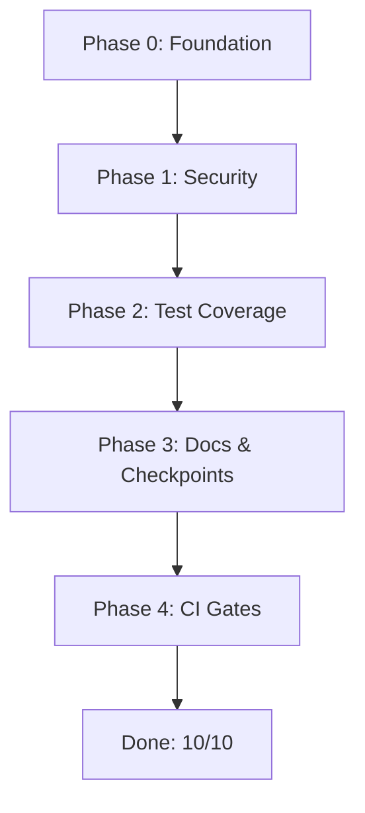

# Zero-Rework Execution Plan: 6.5 → 10/10

## The Problem

We have been fixing the same class of bugs across multiple passes because the foundation was laid in the wrong order. TypeScript strict mode, input validation, and shared infra were deferred. Every subsequent fix had to patch around these gaps, creating new gaps.

## The Principle

**Foundation before feature.** Tasks in each phase are strict prerequisites for the next phase. No phase may start until the previous phase is fully verified.

## Phase Dependency Map

```
Phase 0: Foundation ─────────────────────────────────────────┐
  ├─ 0.1 TypeScript strict: ALL packages                     │
  ├─ 0.2 Zod validation: ALL API routes + action inputs      │  Everything below
  ├─ 0.3 Shared webhook pipeline                             │  DEPENDS on this
  ├─ 0.4 Named constants extraction                          │
  └─ 0.5 Structured logger migration                         │
                                                             │
Phase 1: Security & Correctness ─────────────────────────────┤
  ├─ 1.1 ai-core: remove prisma import (HIGH)                │
  ├─ 1.2 inbox-core: registered action for ingest (HIGH)     │
  ├─ 1.3 MFA dead actions: implement or document             │
  ├─ 1.4 crm.updateLeadStatus: implement or delete           │
  ├─ 1.5 Deal model: add organizationId                      │  Security fixes
  ├─ 1.6 Fix swallowed promises everywhere                   │  depend on Phase 0
  ├─ 1.7 Replace as any with proper types                    │  types + validation
  └─ 1.8 Fix require() in ESM module                         │
                                                             │
Phase 2: Test Coverage ──────────────────────────────────────┤
  ├─ 2.1 auth: session resolvers (CRITICAL untested gate)    │
  ├─ 2.2 webhook-core: core pipeline (CRITICAL untested)     │  Tests depend on
  ├─ 2.3 approval-core: approveRequest/rejectRequest (HIGH)  │  Phase 0 + 1 fix
  ├─ 2.4 ai-core: runTradeAgent (HIGH)                       │  (stable codebase)
  ├─ 2.5 analytics-core: dashboard + funnel (MEDIUM)         │
  ├─ 2.6 trade-core: remaining 8 actions                     │
  ├─ 2.7 crm-core: remaining 14 actions (incl anonymizePii)  │
  ├─ 2.8 inbox-core: create path, error handling             │
  ├─ 2.9 job-core: real behavior tests (not type-only)       │
  └─ 2.10 Integration tests: real Prisma test container      │
                                                             │
Phase 3: Docs & Checkpoints ─────────────────────────────────┤
  ├─ 3.1 Action registry: sync docs ↔ code                   │
  ├─ 3.2 Add CI: doc matches listActions()                   │
  ├─ 3.3 Update checkpoints with all residual risks          │
  └─ 3.4 Document inbox-core / job-core infra exceptions     │
                                                             │
Phase 4: CI & Pre-commit Gates ──────────────────────────────┘
  ├─ 4.1 TypeScript strict pre-commit check
  ├─ 4.2 lint-staged for all packages
  └─ 4.3 AI eval gate in CI pipeline
```

---

# PHASE 0: Foundation

## Rationale

Every issue below (as any, missing types, swallowed errors, code duplication, magic numbers, console.log) is a root cause of rework. Fix them once, correctly, before touching anything else.

---

## T0.1 — Enable TypeScript strict mode in ALL packages

### What

Set `"strict": true` in all 13 tsconfig.json files and fix every resulting compilation error.

### Contract

| Package             | Current strict | Action                       |
| ------------------- | -------------- | ---------------------------- |
| `packages/job-core` | `true`         | No change (proof package)    |
| Root + all others   | `false`        | Change to `true`, fix errors |

### Process

1. Change `"strict": false` → `"strict": true` in each tsconfig.json.
2. Run `pnpm typecheck`.
3. For each error:
   - If it's a real null-safety issue → fix it (add null check, optional chain, or non-null assertion with comment).
   - If it's an `implicit any` → add explicit type annotation.
   - If it's an `undefined` that cannot happen in practice → add `!` assertion with inline comment explaining why.
4. Re-run typecheck after each package until all 13 pass.

### Definition of Done

- `pnpm typecheck` passes: 13/13 packages, 0 errors, 0 warnings.
- No `as any` remains in source files (test files may keep limited `as any` with inline justification).
- Each `!` non-null assertion has an inline comment like `// validated by Zod schema above`.
- `pnpm build` passes after strict mode enabled.

### Verification Command

```bash
pnpm typecheck && pnpm build
```

### Anti-reworks

- Do NOT add `// @ts-nocheck` or `// @ts-ignore` to suppress errors.
- Do NOT set `strict: true` only to immediately add `skipLibCheck: true` (that's already true).
- If a fix requires significant refactoring (e.g., adding generic types), extract it to a follow-up T0.x task instead of half-fixing it.

---

## T0.2 — Add Zod validation to ALL API route inputs and ALL action inputs

### What

Install `zod` at root devDependencies. Create validation schemas for every API route body and every registered action input.

### Schema locations

| Location                   | Schema                                               |
| -------------------------- | ---------------------------------------------------- |
| `apps/web/lib/validate.ts` | Per-route Zod schemas for all POST/PATCH bodies      |
| Each action package        | `ZodSchema<InputType>` exported alongside the action |

### Minimum validation per schema

Every schema MUST validate:

1. `organizationId` is stripped (not accepted from client).
2. Required fields exist and are non-empty strings / positive numbers / valid enums.
3. String fields have max length (256 default, 4096 for description/content).
4. Numeric fields are finite numbers within expected range.
5. URL fields match URL format.
6. Email fields match email format.
7. Enum fields match the literal union (not freeform string).
8. Nested arrays/objects are validated recursively.

### Implementation pattern

```typescript
// apps/web/lib/validate.ts
import { z } from "zod";

export const createLeadSchema = z
  .object({
    companyId: z.string().cuid().optional(),
    source: z.string().min(1).max(256),
    name: z.string().max(256).optional(),
    phone: z.string().max(32).optional(),
    email: z.string().email().max(256).optional(),
    need: z.string().max(4096).optional(),
  })
  .strict(); // no extra fields

export const draftQuotationSchema = z
  .object({
    leadId: z.string().cuid(),
    title: z.string().min(1).max(512),
    content: z.string().max(65536),
    items: z
      .array(
        z.object({
          productId: z.string().cuid().optional(),
          description: z.string().min(1).max(4096),
          quantity: z.number().positive().finite(),
          unit: z.string().max(64).optional(),
          unitPrice: z.number().nonnegative().finite(),
        }),
      )
      .min(1)
      .max(100),
  })
  .strict();
```

### API route integration

```typescript
// apps/web/app/api/leads/route.ts
import { createLeadSchema } from "@/lib/validate";

export async function POST(request: Request) {
  const body = createLeadSchema.parse(await request.json());
  // body is now fully typed + validated
}
```

### Action handler integration

```typescript
// packages/crm-core/src/index.ts
import { z } from "zod";

export const createLeadInputSchema = z
  .object({
    companyId: z.string().cuid().optional(),
    source: z.string().min(1).max(256),
    // ...
  })
  .strict();

export type CreateLeadInput = z.infer<typeof createLeadInputSchema>;

// In handler:
const parsed = createLeadInputSchema.parse(input);
```

### Definition of Done

- `zod` installed at workspace root.
- Every `POST`/`PATCH` API route validates body via Zod before processing.
- Every registered action handler validates input via Zod before using.
- `pnpm typecheck` + `pnpm build` pass.
- Existing tests that pass valid inputs continue to pass.
- Invalid inputs produce `ZodError` with clear message, caught by route error handler → 400 response.

### Verification Command

```bash
pnpm typecheck && pnpm build && pnpm test
```

### Anti-reworks

- Do NOT use `.passthrough()` — always `.strict()` to reject unknown fields.
- Do NOT skip validation on "simple" routes — every route gets a schema.
- Do NOT put validation inside the handler — validate at route entry, then pass typed body.
- Error messages must be safe for client consumption (`ZodError.issues` formatted, no stack traces).

---

## T0.3 — Extract shared webhook processing pipeline

### What

The 4 webhook route handlers (`whatsapp/route.ts`, `zalo/route.ts`, `email/route.ts`, `inbox/route.ts`) share ~70% structure. Extract a single `processWebhookRequest()` function.

### New file

`packages/webhook-core/src/pipeline.ts`

### Extracted function signature

```typescript
type WebhookPipelineInput = {
  channel: ChannelType;
  body: unknown;
  extractMessage: (body: unknown) => {
    externalId?: string;
    text: string;
    sender?: string;
    metadata?: Record<string, unknown>;
  };
  tenantResolver: () => Promise<{
    organizationId: string;
    integration?: WebhookIntegration;
  }>;
  signatureVerifier?: () => Promise<boolean>;
};

export async function processWebhookRequest(
  input: WebhookPipelineInput,
): Promise<Response>;
```

### Pipeline steps (extracted exactly once)

```
1. checkPayloadSize(request)
2. JSON.parse body
3. resolve tenant (via integration or shared secret)
4. verify signature (if verifier provided)
5. checkWebhookRateLimit(organizationId, channel)
6. buildWebhookEventKey(channel, externalId, ...)
7. receiveWebhookEvent → idempotency check (DUPLICATE → return 200)
8. If duplicate: return 200 immediately
9. Try ingestInboundMessage(organizationId, ...)
10. Try runTradeAgent(organizationId, message)
11. markWebhookProcessed(webhookEvent.id, result)
12. Return 200
13. On any error: markWebhookFailed + return apiErrorResponse
```

### Route files after extraction

Each route file is reduced to:

```typescript
// apps/web/app/api/webhooks/whatsapp/route.ts
export async function POST(request: Request) {
  return processWebhookRequest({
    channel: "WHATSAPP",
    body: await request.json(),
    extractMessage: extractWhatsAppMessage,
    tenantResolver: () =>
      resolveWebhookTenantFromIntegration(
        "WHATSAPP",
        extractWhatsAppProviderAccountId(body),
      ),
    signatureVerifier: () => verifyWhatsAppSignature(request, secret),
  });
}
```

### Definition of Done

- `packages/webhook-core/src/pipeline.ts` contains the single pipeline.
- All 4 route files delegate to it.
- All 4 existing webhook tests pass (signature verification still works).
- `pnpm build` + `pnpm test` pass.
- No duplicated webhook logic remains across the 4 route files.

### Verification Command

```bash
pnpm test && pnpm build && pnpm --filter @tradeos/webhook-core test
```

### Anti-reworks

- Do NOT create a class or OOP wrapper. Pure function only.
- Do NOT import route-specific types into pipeline.ts. Route files pass in adapters.
- Error handling must be centralized — no `.catch(() => {})` in the pipeline.

---

## T0.4 — Extract named constants for all magic numbers

### What

Find every literal number/string threshold across the codebase and replace with a named constant.

### Search patterns

| Pattern                          | Replacement                                                           |
| -------------------------------- | --------------------------------------------------------------------- |
| `60` (rate limit window/max)     | `RATE_LIMIT_WINDOW_SECONDS = 60` in `webhook-core/src/constants.ts`   |
| `24 * 60 * 60 * 1000`            | `ONE_DAY_MS` in shared constants                                      |
| `7 * 24 * 60 * 60 * 1000`        | `SEVEN_DAYS_MS`                                                       |
| `220` (text slice)               | `MAX_SUMMARY_LENGTH` in `ai-core`                                     |
| `120` (event key text slice)     | `MAX_EVENT_KEY_TEXT_LENGTH` in `webhook-core`                         |
| `90` (retention days)            | `DEFAULT_RETENTION_DAYS`                                              |
| `1000` (poll interval)           | `DEFAULT_POLL_INTERVAL_MS` in `job-core`                              |
| `0.6`, `0.3`, `0.5` (confidence) | `CONFIDENCE_HIGH`, `CONFIDENCE_MEDIUM`, `CONFIDENCE_LOW` in `ai-core` |
| `256` (payload KB)               | `MAX_PAYLOAD_SIZE_KB` in `webhook-core`                               |
| `500` (audit truncation)         | `MAX_AUDIT_DISPLAY_LENGTH` in policy-core                             |
| `10` (recursion depth)           | `MAX_REDACT_DEPTH` in policy-core                                     |

### File pattern

```typescript
// packages/webhook-core/src/constants.ts
export const RATE_LIMIT_WINDOW_SECONDS = 60;
export const RATE_LIMIT_MAX_EVENTS = 60;
export const MAX_PAYLOAD_SIZE_KB = 256;
export const MAX_EVENT_KEY_TEXT_LENGTH = 120;
export const DEFAULT_RETENTION_DAYS = 90;
```

### Definition of Done

- All instances of these literal values in source files (not test files, not seed files) are replaced with `import { CONSTANT }`.
- `pnpm build` + `pnpm test` pass.
- `git diff --check` passes (no whitespace errors).

### Verification Command

```bash
pnpm build && pnpm test
```

---

## T0.5 — Migrate console.log → structured logger

### What

Replace all `console.log` / `console.error` in source files with the existing `createLogger` from `apps/web/lib/logger.ts`, or create a shared logger package.

### Actions

1. Create `packages/shared-logger/src/index.ts` or move `createLogger` to a shared location.
2. Replace:
   - `apps/worker/src/index.ts:8,11` → `logger.info('[worker] Registered processors...')`
   - `apps/web/lib/api-errors.ts:169` → `logger.error(...)`
   - `packages/database/prisma/seed.ts` → these are CLI scripts, keep `console.log` for now (acceptable per 12-factor app standard).

3. Logger format must include: `timestamp`, `level`, `message`, optional `context` object.

### Definition of Done

- Zero `console.log` / `console.error` calls in source packages (excluding seeds and CLI scripts).
- All logging goes through structured logger with level + message + context.
- `pnpm build` passes.

### Verification Command

```bash
pnpm build && grep -rn 'console\.\(log\|error\)' packages/ apps/ --include='*.ts' | grep -v node_modules | grep -v '__tests__' | grep -v 'prisma/seed' | grep -v '.next'
# Expected: zero output
```

---

# PHASE 1: Security & Correctness

## Prerequisites

Phase 0 must be fully complete and verified before starting Phase 1. TypeScript strict mode + Zod validation + shared pipeline will prevent the most common bug classes that Phase 1 touches.

---

## T1.1 — Remove `prisma` import from `ai-core` (HIGH — Rule 2 / 10.3)

### What

The file `packages/ai-core/src/index.ts` currently imports `prisma` directly and calls:

- `prisma.organization.findUnique()` — in `getAiBudget()`
- `prisma.aiUsageEvent.findMany()` — in `getAiBudget()`
- `prisma.aiUsageEvent.create()` — in `trackAiUsage()`

### Fix

1. Create registered action `ai.trackUsage` in `crm-core` (where billing/ai actions live):

```typescript
// packages/crm-core/src/index.ts
registerAction({
  name: "ai.trackUsage",
  description: "Record AI usage event for billing",
  riskLevel: "LOW" as RiskLevel,
  allowedRoles: DEFAULT_ADMIN_ROLES,
  requiresApprovalForAI: false,
  handler: async (input: AiUsageEventInput, context) => {
    const db = getDb(context);
    await db.aiUsageEvent.create({
      data: { ...input, organizationId: context.organizationId! },
    });
  },
});
```

2. Create a `budget.getStatus` action or a server-side read helper:

```typescript
// In crm-core or a new analytics read package
registerAction({
  name: 'budget.getStatus',
  description: 'Get AI budget and usage for organization',
  riskLevel: 'LOW',
  allowedRoles: DEFAULT_ADMIN_ROLES,
  requiresApprovalForAI: false,
  handler: async (input: { organizationId: string }, context) => {
    const db = getDb(context);
    const org = await db.organization.findUnique({
      where: { id: context.organizationId! },
      select: { aiMonthlyBudget: true },
    });
    const recentUsage = await db.aiUsageEvent.findMany({ ... });
    return { budget: org?.aiMonthlyBudget, usage: recentUsage };
  },
});
```

3. Update `ai-core/src/index.ts`:
   - Remove `import { prisma } from '@tradeos/database'`.
   - Replace `getAiBudget` with `executeAction('budget.getStatus', ...)`.
   - Replace `trackAiUsage` with `executeAction('ai.trackUsage', ...)`.

### Definition of Done

- `packages/ai-core` has zero imports from `@tradeos/database` or `@prisma/client`.
- `ai-core/src/index.ts` only imports from `@tradeos/policy-core`, `@tradeos/approval-core`, and standard libraries.
- All existing 48 ai-core tests pass.
- `pnpm typecheck` + `pnpm build` pass.
- `grep -r "from '@tradeos/database'" packages/ai-core/` returns zero matches.

### Verification Command

```bash
grep -r "from '@tradeos/database'" packages/ai-core/ && echo "FAIL" || echo "PASS"
pnpm build
pnpm --filter @tradeos/ai-core test
```

### Anti-reworks

- Do NOT re-export prisma from another package into ai-core. That's just indirection.
- The `budget.getStatus` action is read-only, but still goes through `executeAction` for audit consistency. That's fine — audit records are cheap; security gaps are not.

---

## T1.2 — inbox-core: wrap mutations in registered action (HIGH)

### What

`inbox-core/src/index.ts` calls direct Prisma mutations in `findOrCreateConversation()` and `ingestInboundMessage()`. These bypass audit, permission, and MFA.

### Fix

1. Register a new action `inbox.ingestMessage` in `inbox-core`:

```typescript
// packages/inbox-core/src/index.ts
registerAction({
  name: "inbox.ingestMessage",
  description: "Ingest an inbound message, creating or updating conversation",
  riskLevel: "LOW" as RiskLevel,
  allowedRoles: ["OWNER", "ADMIN", "SALES", "OPERATOR"] as ActorRole[],
  requiresApprovalForAI: false,
  handler: async (input: IngestInboundMessageInput, context) => {
    const db = getDb(context);
    // existing findOrCreateConversation + message create logic here
    // using db (transaction client) instead of prisma
  },
});
```

2. Update all callers of `ingestInboundMessage` to call `executeAction('inbox.ingestMessage', ...)` instead.

3. Callers in webhook routes will use the shared pipeline (T0.3) which will call the action.

### Documentation

Add to `docs/04_ACTION_REGISTRY.md`: section "Direct Database Mutation Exceptions" — remove inbox-core from the implicit exception list.

### Definition of Done

- `inbox-core` has one registered action `inbox.ingestMessage`.
- All callers use `executeAction('inbox.ingestMessage', ...)`.
- Audit log written for every message ingest.
- `pnpm build` + `pnpm test` pass.

---

## T1.3 — Fix 4 dead actions in ALWAYS_REQUIRE_MFA_ACTIONS

### Options

For each action, EITHER implement the missing `registerAction()` call, OR remove from the MFA set with documented rationale.

### Decision

| Action              | Decision                       | Rationale                                                                                          |
| ------------------- | ------------------------------ | -------------------------------------------------------------------------------------------------- |
| `privacy.anonymize` | Remove from MFA set            | Duplicate of `privacy.anonymizePii` (different name, same purpose). Keep `privacy.anonymizePii`.   |
| `privacy.legalHold` | Implement as registered action | Legal hold toggles are sensitive, should be audited + MFA-protected.                               |
| `billing.manage`    | Keep in MFA set                | Future action for billing management. Add TODO comment: `// TODO: implement billing.manage action` |
| `user.roleUpdate`   | Implement as registered action | Role changes are HIGH risk. Should be audited + MFA-protected. Move from crm-core or implement.    |

### Changes

1. Remove `privacy.anonymize` from `ALWAYS_REQUIRE_MFA_ACTIONS` in `packages/policy-core/src/index.ts`.
2. Add `registerAction({ name: 'privacy.legalHold', riskLevel: 'HIGH', ... })` in `crm-core`.
3. Add `registerAction({ name: 'user.roleUpdate', riskLevel: 'HIGH', ... })` in `crm-core`.
4. Add TODO comment for `billing.manage`.

### Definition of Done

- Every action in `ALWAYS_REQUIRE_MFA_ACTIONS` either has a `registerAction()` call or a documented reason for not having one.
- `pnpm build` passes.

---

## T1.4 — crm.updateLeadStatus: implement or delete

### Fix

Choose ONE:

**Option A: Implement**

- Add `registerAction({ name: 'crm.updateLeadStatus', riskLevel: 'LOW', ... })` in `crm-core`.
- Update `PATCH /api/leads/:id` route handler to call `executeAction('crm.updateLeadStatus', ...)`.
- Update `docs/04_ACTION_REGISTRY.md` and `docs/07_API_CONTRACT.md` to match actual behavior.

**Option B: Delete from docs**

- Remove row from `docs/04_ACTION_REGISTRY.md`.
- Remove reference from `docs/07_API_CONTRACT.md`.

### Recommended

Option A (implement) — the API contract already expects it and the PATCH route exists.

### Definition of Done

- `crm.updateLeadStatus` is either a working registered action or fully removed from docs.
- `docs/04_ACTION_REGISTRY.md` + `docs/07_API_CONTRACT.md` are consistent with code.
- `pnpm build` passes.

---

## T1.5 — Deal model: add organizationId

### What

`schema.prisma:263-277` — `Deal` model lacks `organizationId`.

### Fix

```prisma
model Deal {
  id             String   @id @default(cuid())
  organizationId String
  companyId      String?
  leadId         String?
  title          String
  stage          String   @default("new")
  value          Decimal?
  currency       String?
  metadata       Json?
  createdAt      DateTime @default(now())
  updatedAt      DateTime @updatedAt

  organization Organization @relation(fields: [organizationId], references: [id], onDelete: Cascade)
  company      Company?     @relation(fields: [companyId], references: [id], onDelete: SetNull)
  lead         Lead?        @relation(fields: [leadId], references: [id], onDelete: SetNull)

  @@index([organizationId])
}
```

### Regenerate migration

```bash
cd packages/database && npx prisma migrate diff --from-empty --to-schema-datamodel prisma/schema.prisma --script > prisma/migrations/20260522_deal_orgid/migration.sql
```

### Definition of Done

- `Deal.organizationId` is `String`, non-nullable, with `Organization` relation + `Cascade` delete + `@@index`.
- Migration SQL file created.
- `pnpm db:generate` passes.

---

## T1.6 — Fix swallowed Promise rejections

### Files to fix

| File                                            | Lines | Fix                                                                  |
| ----------------------------------------------- | ----- | -------------------------------------------------------------------- |
| `apps/web/app/settings/billing/page.tsx`        | 35-39 | Add state variable `fetchError`, render error banner on failure      |
| `apps/web/app/settings/ai/page.tsx`             | 24    | Same pattern                                                         |
| `apps/web/app/settings/privacy/page.tsx`        | 19    | Remove `.catch(() => setLoaded(true))`, track error state separately |
| `apps/web/app/api/webhooks/[id]/retry/route.ts` | 65    | Add `logger.error('Failed to mark webhook as failed', error)`        |

### Pattern for client components

```typescript
const [error, setError] = useState<string | null>(null);
const [loaded, setLoaded] = useState(false);

useEffect(() => {
  fetch("/api/settings/...")
    .then((r) => (r.ok ? r.json() : Promise.reject("FETCH_FAILED")))
    .then((data) => {
      setData(data);
      setLoaded(true);
    })
    .catch((err) => {
      setError("Failed to load settings");
      setLoaded(true);
    });
}, []);
```

### Definition of Done

- Zero `.catch(() => {})` or `.catch(() => void 0)` in source files.
- Every Promise rejection produces either a user-visible error message or a structured log entry.
- `grep -rn '\.catch(()' apps/ packages/ --include='*.ts' --include='*.tsx' | grep -v node_modules | grep -v __tests__` returns zero matches.

---

## T1.7 — Replace `as any` with proper types

### Files to fix

| File                                  | Lines   | Issue                                       | Fix                                                                                  |
| ------------------------------------- | ------- | ------------------------------------------- | ------------------------------------------------------------------------------------ |
| `auth/src/tenant.ts`                  | 51      | `role: activeMembership?.role?.name as any` | Create `ActorRole` cast function: `toActorRole(membership?.role?.name) ?? user.role` |
| `auth/src/demo.ts`                    | 64      | Same pattern                                | Same fix                                                                             |
| `webhook-core/src/index.ts`           | 235-236 | `(body as any)?.entry?.[0]...`              | Create `WhatsAppPayload` type and typed accessor                                     |
| `apps/web/.../inbox/route.ts`         | 101     | `channel: channel.toLowerCase() as any`     | Use safe channel parser: `parseChannel(channel)`                                     |
| `apps/web/.../retry/route.ts`         | 46      | Same pattern                                | Same fix                                                                             |
| `apps/web/.../introductions/route.ts` | 51      | `where: where as any`                       | Type as `Prisma.IntroductionRequestWhereInput`                                       |

### Definition of Done

- Zero `as any` in source files (excluding test setup mocks).
- Each replacement uses proper TypeScript types or branded types.
- `pnpm typecheck` passes.
- `grep -rn 'as any' apps/ packages/ --include='*.ts' --include='*.tsx' | grep -v node_modules | grep -v __tests__ | grep -v '\.test\.'` returns zero matches.

---

## T1.8 — Fix `require()` in ESM module

### File

`packages/ai-core/src/eval/run-eval.ts:213-214`

### Fix

```typescript
// Replace:
const fs = require("fs");
const path = require("path");

// With:
import * as fs from "node:fs";
import * as path from "node:path";
```

### Definition of Done

- Zero `require()` calls in `.ts` files (excluding `index.js` / `cjs` config files).
- `pnpm build` passes.
- `grep -rn 'require(' packages/ --include='*.ts' | grep -v node_modules | grep -v __tests__ | grep -v '\.test\.'` returns zero matches.

---

# PHASE 2: Test Coverage

## Prerequisites

Phases 0 + 1 must be complete. Fixing tests while the codebase type system and validation are in flux is rework. The codebase must be stable before writing tests.

---

## T2.1 — auth: test session resolvers (CRITICAL gate)

### What to test

| Function                      | File                 | Risk                     |
| ----------------------------- | -------------------- | ------------------------ |
| `requireSessionFromRequest()` | `auth/src/tenant.ts` | HIGH — entry to all auth |
| `resolveSessionFromEmail()`   | `auth/src/tenant.ts` | HIGH — tenant resolution |
| `assertSameOrganization()`    | `auth/src/tenant.ts` | HIGH — tenant isolation  |
| `assertRole()`                | `auth/src/tenant.ts` | HIGH — RBAC              |

### Test scenarios per function

`requireSessionFromRequest`:

- Valid JWT cookie → returns SessionContext with userId, orgId, role, permissions
- No cookie → throws AUTH_REQUIRED
- Malformed cookie → throws AUTH_REQUIRED
- Expired JWT → throws AUTH_REQUIRED
- JWT for unknown user → throws AUTH_REQUIRED
- User with no organization memberships → throws or returns demo (depending on env)
- Chunked Supabase cookie → reassembles correctly
- Cookie for wrong Supabase project ref → ignores, falls through to error

`resolveSessionFromEmail`:

- Email matches active OrganizationMember → returns session with that org
- Email matches multiple orgs → returns session with specified targetOrgId
- Email has no membership → falls back to legacy User.organizationId
- Email not found → throws AUTH_REQUIRED
- Membership status not ACTIVE → throws ACCESS_DENIED

`assertSameOrganization`:

- Matching orgId → passes
- Mismatching orgId → throws ORGANIZATION_ACCESS_DENIED
- Null/undefined comparison → throws ORGANIZATION_ACCESS_DENIED

`assertRole`:

- User has required role → passes
- User has lower role → throws ROLE_ACCESS_DENIED
- User role via membership → checks membership role, not legacy user.role

### Definition of Done

- Minimum 15 tests across these 4 functions.
- Every branch is covered (success, failure, edge case).
- `pnpm --filter @tradeos/auth test` passes.

---

## T2.2 — webhook-core: test core pipeline functions (CRITICAL gate)

### What to test

| Function                                | Tests needed                                                                                         |
| --------------------------------------- | ---------------------------------------------------------------------------------------------------- |
| `receiveWebhookEvent()`                 | Idempotency: new event creates RECEIVED; duplicate returns existing; org+channel+eventKey uniqueness |
| `requireWebhookTenant()`                | Production: env secret validates header; Demo: returns demo org; Missing env: throws                 |
| `resolveWebhookTenantFromIntegration()` | Matching integration found; No integration matches; Integration DISABLED                             |
| `buildWebhookEventKey()`                | Deterministic for same inputs; Different for different inputs; Text truncation at 120 chars          |
| `checkWebhookRateLimit()`               | Under limit: returns false; Over limit: returns true with error; No prior events: passes             |
| `verifyZaloSignature()`                 | Valid HMAC passes; Invalid HMAC fails; Missing signature header                                      |
| `verifyEmailSignature()`                | Mailgun valid; Mailgun invalid; Shared secret fallback; Missing secret                               |

### Definition of Done

- Minimum 20 tests across webhook-core.
- All pipeline functions have at least success + failure path coverage.
- `pnpm --filter @tradeos/webhook-core test` passes.

---

## T2.3 — approval-core: test approveRequest/rejectRequest (HIGH)

### What to test

`approveRequest`:

- PENDING → APPROVED transition succeeds
- Already APPROVED → throws INVALID_TRANSITION
- REJECTED → throws INVALID_TRANSITION
- Non-existent approval → throws NOT_FOUND
- Org mismatch → throws ACCESS_DENIED
- Audit log written with correct data

`rejectRequest`:

- PENDING → REJECTED transition succeeds
- Already APPROVED → throws INVALID_TRANSITION
- Non-existent → throws NOT_FOUND
- Org mismatch → throws ACCESS_DENIED
- Audit log written

`assertValidTransition` (edge cases):

- APPROVED → APPROVED (invalid)
- PENDING → EXECUTING (invalid)
- EXECUTED → FAILED (valid)
- EXECUTING → EXECUTED (valid)
- EXECUTING → FAILED (valid)

### Definition of Done

- Minimum 15 new tests (total 23+ for approval-core).
- Every status transition in `VALID_TRANSITIONS` is tested (valid + invalid).
- `pnpm --filter @tradeos/approval-core test` passes.

---

## T2.4 — ai-core: test runTradeAgent (HIGH)

### What to test

`runTradeAgent()` — the main AI pipeline:

- Detects intent → plans steps → executes LOW/MEDIUM actions
- HIGH risk action → creates approval request, returns PENDING_APPROVAL
- Prompt injection detected → returns BLOCKED status
- Budget exceeded → returns BUDGET_EXCEEDED status
- LLM failure → falls back to keyword detection
- Empty/missing message → returns reasonable error
- Step execution failure → returns step with error
- All steps complete → returns EXECUTED status

### Mock strategy

Mock `executeAction`, `createApprovalRequest`, `getAiBudget`, `trackAiUsage` from policy-core and crm-core. Do NOT mock `detectTradeIntent` or `planTradeAgent` — those are the functions being integrated.

### Definition of Done

- Minimum 10 tests for `runTradeAgent`.
- Covers: LOW execution, HIGH approval, injection block, budget limit, LLM fallback.
- `pnpm --filter @tradeos/ai-core test` passes (48 existing + 10 new = 58+).

---

## T2.5–T2.9 — Remaining package tests

### Minimum test targets per package

| Task | Package        | Existing | Target | Key functions to test                                                                                                                                                                                                             |
| ---- | -------------- | -------- | ------ | --------------------------------------------------------------------------------------------------------------------------------------------------------------------------------------------------------------------------------- |
| T2.5 | analytics-core | 4        | 12+    | `getDashboardMetrics`, `getFunnelMetrics`, `generateWeeklyReport`, `anonymizeTenantPii`, `getBillingMetrics`, `getPlanLimits`                                                                                                     |
| T2.6 | trade-core     | 3        | 10+    | `sendQuotation`, `proposeIntroduction`, `rejectIntroduction`, `disputeIntroduction`, `createProduct`, `updateProduct`, `suggestPartner`                                                                                           |
| T2.7 | crm-core       | 3        | 15+    | `createLead`, `createContact`, `updateContact`, `updateCompany`, `user.invite`, `notification.draft`, `billing.planUpdate`, `ai.budgetUpdate`, `settings.security`, `organization.settings.introductions`, `privacy.anonymizePii` |
| T2.8 | inbox-core     | 2        | 6+     | `ingestInboundMessage` create path, `findOrCreateConversation` in isolation, error handling, multiple messages to same conversation                                                                                               |
| T2.9 | job-core       | 12       | 20+    | `enqueueJob`, `claimNextJob` (atomic + race), `completeJob`, `failJob` (retry + final), `cancelJob`, `recoverStaleRunningJobs`                                                                                                    |

### Verification pattern

Each test must verify:

1. Correct data is written/read.
2. Organization ID is respected (tenant isolation).
3. Audit log is written (if applicable).
4. Error cases produce correct error types.
5. Role/permission gating (if applicable).

### Definition of Done (for all T2.5–T2.9)

- All target test counts met.
- `pnpm test` passes: minimum 180 tests total (116 existing + ~65 new).
- Each package's tests pass independently.

---

## T2.10 — Integration tests with real Prisma test container

### What

Set up a Docker-based PostgreSQL test container and run integration tests that validate mock fidelity.

### Implementation

1. Create `packages/integration-tests/` package.
2. Use `testcontainers` npm package to spin up PostgreSQL.
3. Run `prisma migrate deploy` to apply migrations.
4. Seed minimum test data.
5. Run tests that:
   - Create an organization + user via Prisma directly.
   - Execute a registered action through `executeAction()`.
   - Verify the audit log was written.
   - Verify tenant isolation (cross-org access blocked).
   - Verify MFA enforcement (aal1 blocked, aal2 passes).

### Definition of Done

- `packages/integration-tests/` with minimum 5 tests.
- Tests can run with: `pnpm --filter @tradeos/integration-tests test` (requires Docker running).
- CI can skip these if Docker unavailable, but the runner must exist.

---

# PHASE 3: Docs & Checkpoints

## Prerequisites

Phases 0 + 1 + 2 must be complete. Docs must reflect the actual code.

---

## T3.1 — Sync docs/04_ACTION_REGISTRY.md with actual code

### What

The action registry doc must match `listActions()` output exactly.

### Process

1. Create a script `scripts/verify-action-docs.mjs` that:
   - Calls `listActions()` (by importing the packages and running them).
   - Parses the action table from `docs/04_ACTION_REGISTRY.md`.
   - Compares: name, risk level, allowed roles, requiresApprovalForAI.
   - Reports any mismatch.

2. Fix all mismatches found by the script:
   - 7 `requiresApprovalForAI` mismatches: update code OR docs.
   - `crm.updateCompany` + `crm.updateContact` OPERATOR role: add to docs.
   - Add `ai.trackUsage` + `budget.getStatus` to table (from T1.1).
   - Add `inbox.ingestMessage` to table (from T1.2).
   - Add `privacy.legalHold` + `user.roleUpdate` (from T1.3).
   - Remove `privacy.anonymize` from table.
   - Add TODO for `billing.manage`.
   - Fix `crm.updateLeadStatus` (from T1.4).

### Definition of Done

- `scripts/verify-action-docs.mjs` runs and reports zero mismatches.
- Every action in `listActions()` has a row in the table.
- Every row in the table corresponds to a real `registerAction()` call.
- `pnpm build` passes.

---

## T3.2 — Add CI step to verify action registry docs

### What

Add a GitHub Actions workflow or CI step that runs `scripts/verify-action-docs.mjs` and fails if any mismatch is found.

### Implementation

```yaml
# .github/workflows/verify-actions.yml
name: Verify Action Registry Docs
on: [pull_request]
jobs:
  verify:
    runs-on: ubuntu-latest
    steps:
      - uses: actions/checkout@v4
      - uses: actions/setup-node@v4
      - run: corepack enable && pnpm install
      - run: node scripts/verify-action-docs.mjs
```

### Definition of Done

- `.github/workflows/verify-actions.yml` exists and is valid.
- Script can run standalone (no Docker required).

---

## T3.3 — Update checkpoints with all residual risks

### Changes to `docs/13_CHECKPOINTS.md`

Add a "Known Residual Risks" section:

```markdown
## Known Residual Risks (as of 2026-05-22)

| Risk                                 | Severity | Status        | Notes                               |
| ------------------------------------ | -------- | ------------- | ----------------------------------- |
| ai-core reads/writes Prisma directly | HIGH     | Fixed in T1.1 | Remove entry when T1.1 merged       |
| inbox-core mutations bypass audit    | HIGH     | Fixed in T1.2 | Remove entry when T1.2 merged       |
| 4 MFA actions have no handler        | HIGH     | Fixed in T1.3 | Remove entry when T1.3 merged       |
| `strict: false` in tsconfig          | HIGH     | Fixed in T0.1 | Remove entry when T0.1 merged       |
| webhook-core test coverage < 20%     | HIGH     | Fixed in T2.2 | Remove entry when T2.2 merged       |
| auth session resolver zero tests     | HIGH     | Fixed in T2.1 | Remove entry when T2.1 merged       |
| Worker audit attribution missing     | MEDIUM   | Accepted      | Worker cannot resolve user sessions |
| Demo auth always returns aal1        | MEDIUM   | Accepted      | By design per RULES.md 2.2          |
| MFA check skips when orgId undefined | MEDIUM   | Accepted      | ActionContext requires orgId        |
| No E2E tests                         | MEDIUM   | Future        | Playwright setup deferred           |
```

### Definition of Done

- Checkpoint document has current status + all known risks.
- No HIGH or CRITICAL issue is undocumented.

---

## T3.4 — Document infra exceptions

### Changes

1. `docs/04_ACTION_REGISTRY.md` — section "Direct Database Mutation Exceptions":
   - List: `auth` bootstrap, webhook event receipt, `job-core` operations, migration/seed scripts.
   - Add: `inbox-core` is no longer an exception (wrapped in action per T1.2).
   - Add: `job-core` operations are accepted as infra.

2. `docs/05_AI_AGENT_CONTRACT.md` — update blocked actions list if changed.

---

# PHASE 4: CI & Pre-commit Gates

## Prerequisites

All previous phases complete. CI gates are the final lock to prevent regression.

---

## T4.1 — TypeScript strict pre-commit check

### What

Run `pnpm typecheck` as a pre-commit hook that blocks commits if type errors exist.

### Implementation

```bash
# In package.json root:
"scripts": {
  "precommit": "pnpm typecheck && pnpm lint && pnpm test"
}
```

Or using `husky` + `lint-staged`:

```bash
pnpm add -D husky lint-staged -w
npx husky init
echo "pnpm typecheck && pnpm lint" > .husky/pre-commit
```

### Definition of Done

- `husky` + `lint-staged` installed.
- `pre-commit` hook runs `pnpm typecheck` + `pnpm lint`.
- Hooks are committed to repo.

---

## T4.2 — lint-staged for all packages

### What

Run linter + formatter only on staged files (fast, targeted).

### Configuration

```json
// package.json
"lint-staged": {
  "*.{ts,tsx}": ["eslint --fix", "prettier --write"],
  "*.{json,md,yaml}": ["prettier --write"]
}
```

### Definition of Done

- `lint-staged` runs on `git commit`.
- Only staged files are checked.

---

## T4.3 — AI eval gate in CI pipeline

### What

Run `pnpm --filter @tradeos/ai-core eval` as a CI requirement for any PR that touches `packages/ai-core/`.

### Implementation

Add to GitHub Actions workflow:

```yaml
- name: AI Eval
  if: contains(github.event.pull_request.files.*.path, 'packages/ai-core/')
  run: pnpm --filter @tradeos/ai-core eval
  env:
    OPENAI_API_KEY: ${{ secrets.OPENAI_API_KEY }}
```

### Definition of Done

- CI pipeline runs AI eval when ai-core files change.
- Eval thresholds (accuracy ≥85%, FPM ≤5%) enforced.

---

# VERIFICATION CHECKLIST (Run Before Declaring Done)

## Per-Task

```markdown
- [ ] Code compiles: `pnpm typecheck` passes (all packages)
- [ ] Lint passes: `pnpm lint` passes (no warnings)
- [ ] Tests pass: `pnpm test` passes (all packages)
- [ ] Build passes: `pnpm build` passes
- [ ] License check: `pnpm license:check` passes
- [ ] Whitespace: `git diff --check` passes
- [ ] Rule review: No HIGH/CRITICAL issue remains in touched code (RULES.md §0.3)
- [ ] Audit: Mutation path verified (audit log created, tenant isolated)
```

## Per-Phase

```markdown
- [ ] Phase 0: All 5 foundation tasks complete, `pnpm typecheck` passes at strict=true
- [ ] Phase 1: All 8 security tasks complete, zero HIGH violations known
- [ ] Phase 2: Total tests ≥180, all pass, each package independently
- [ ] Phase 3: Docs match code, action registry script passes
- [ ] Phase 4: Pre-commit hooks active, CI gates in place
```

## Final 10/10 Gate

```markdown
- [ ] `pnpm typecheck` = 13/13 packages, 0 errors, 0 warnings
- [ ] `pnpm lint` = 0 warnings (no `next lint` deprecation)
- [ ] `pnpm test` = all pass, minimum 180 tests
- [ ] `pnpm build` = 53/53 static pages
- [ ] `pnpm license:check` = no blocked licenses
- [ ] `pnpm --filter @tradeos/ai-core eval` = accuracy ≥85%, FPM ≤5%
- [ ] `git diff --check` = no whitespace errors
- [ ] TypeScript `strict: true` in all 13 packages
- [ ] Zero `as any` in source files
- [ ] Zero `.catch(() => {})` in source files
- [ ] Zero `console.log`/`console.error` in source files (excl. seeds/CLI)
- [ ] Zero `require()` in `.ts` files
- [ ] Zero hardcoded magic numbers (all named constants)
- [ ] All API routes use Zod validation
- [ ] Action registry docs match `listActions()` exactly
- [ ] All ALWAYS_REQUIRE_MFA_ACTIONS have real handlers
- [ ] CI pipeline has: typecheck, lint, test, build, license-check, action-docs-verify, ai-eval
- [ ] Pre-commit hooks active
- [ ] Checkpoint document current with all residual risks documented
- [ ] No known HIGH or CRITICAL issues remain (self-review against RULES.md)
```

---

# EXECUTION ORDER

Do NOT skip phases. Do NOT parallelize tasks within a phase (they touch overlapping files). Do NOT start a phase without the previous phase's verification checklist passing.



Total estimated tasks: 30 (5 + 8 + 10 + 4 + 3).
